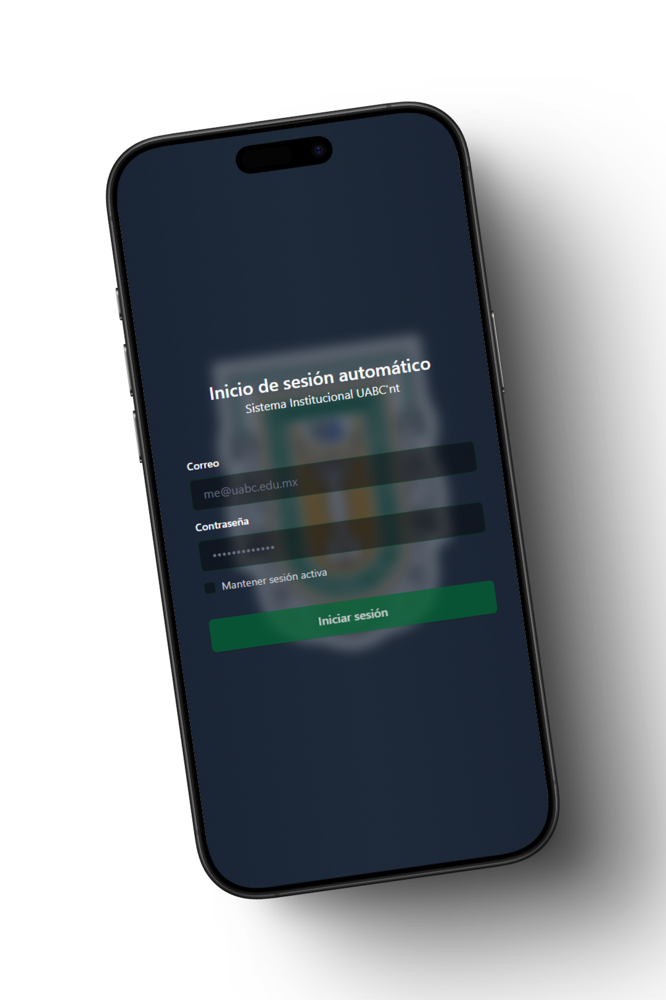

<div align="center">

# Cima Sync - Cimarrones Unidos



**Autenticación automática para la red WiFi de la Universidad Autónoma de Baja California**

[](https://rust-lang.org)
[](https://reactjs.org)
[](https://tauri.app)
[](https://www.typescriptlang.org)

</div>

---

## 📋 Descripción

**Cyma Sync** es una aplicación de escritorio multiplataforma que automatiza el proceso de autenticación en el portal cautivo de la red WiFi de la Universidad Autónoma de Baja California (UABC). La aplicación detecta automáticamente cuando el usuario se conecta a la red UABC y realiza el login de forma transparente, eliminando la necesidad de ingresar manualmente las credenciales cada vez.

### ✨ Características Principales

- 🔄 **Autenticación Automática**: Login automático al conectarse a la red UABC
- 🔒 **Almacenamiento Seguro**: Guardado local de credenciales con encriptación
- ⚡ **Monitoreo Continuo**: Verificación periódica de la conexión
- 🛡️ **Multiplataforma**: Funciona en Windows, macOS y Linux
- 🎯 **Todo Bajo Control**: Ejecución en segundo plano con icono en la bandeja del sistema

---

## 🏗️ Arquitectura del Proyecto

### Stack

**Frontend:**
- **React 18** - Framework de UI
- **TypeScript** - Tipado estático
- **Tailwind CSS** - Framework de estilos
- **Vite** - Build tool y dev server

**Backend:**
- **Rust** - Lógica de autenticación y networking
- **Tauri 2** - Framework para aplicaciones de escritorio
- **reqwest** - Cliente HTTP para Rust
- **SQLite** - Base de datos local

### Estructura del Proyecto

```
Cima-Sync/
├── src/                    # Frontend React + TypeScript
│   ├── components/         # Componentes reutilizables
│   ├── controller/         # Controladores de base de datos
│   ├── hooks/             # Custom hooks
│   └── assets/            # Imágenes e iconos
├── src-tauri/             # Backend Rust + Tauri
│   ├── src/
│   │   ├── auth.rs        # Lógica de autenticación
│   │   ├── lib.rs         # Lógica de ejecución de los procesos
│   │   └── tray.rs        # Gestión del tray icon
│   └── Cargo.toml         # Dependencias de Rust
└── package.json           # Dependencias de Node.js
```


## 🚀 Instalación y Uso

### Prerrequisitos

- **Rust** (versión 1.70+)
- **Node.js** (versión 18+) o **Bun**
- **Cargo** (incluido con Rust)

### Instalación

1. **Clonar el repositorio**
   ```bash
   git clone https://github.com/Yoyiyoniu/Cima-Sync.git
   cd Cima-Sync
   ```

2. **Instalar dependencias**
   ```bash
   # Instalar dependencias de Node.js
   npm install
   # o con Bun
   bun install
   ```

3. **Compilar y ejecutar**
   ```bash
   # Modo desarrollo escritorio
   npm run tauri dev
   
   # Construir para producción
   npm run tauri build
   ```

---

## 🔒 Seguridad

### Almacenamiento de Credenciales
- Las credenciales se almacenan localmente en una base de datos SQLite
- Los datos se encriptan antes de ser guardados
- No se transmiten a servidores externos

### Certificados SSL
- La aplicación maneja certificados SSL autofirmados del portal UABC
- Se utilizan configuraciones seguras para las peticiones HTTP

---

## 🛠️ Desarrollo

### Scripts Disponibles

```bash
# Desarrollo
npm run dev          # Servidor de desarrollo Vite
npm run tauri dev    # Aplicación Tauri en modo desarrollo

# Construcción
npm run build        # Build del frontend
npm run tauri build  # Build de la aplicación completa

# Otros
npm run preview      # Preview del build
```

### Estructura de Desarrollo

- **Frontend**: `src/` - React + TypeScript + Tailwind CSS
- **Backend**: `src-tauri/src/` - Rust + Tauri
- **Configuración**: `src-tauri/tauri.conf.json` - Configuración de Tauri

## 🤝 Contribución

Las contribuciones son bienvenidas.

---

## 📄 Licencia

Este proyecto está bajo la Licencia MIT. Ver el archivo `LICENSE` para más detalles.

---

## ⚠️ Descargo de Responsabilidad

El autor estaba cansado porque siempre se le desconectaba asi que creo esta aplicación.

---

## 👨‍💻 Autor

**Rodrigo Gibran Felix Leon**

- 🎓 Estudiante de la Universidad Autónoma de Baja California

---

