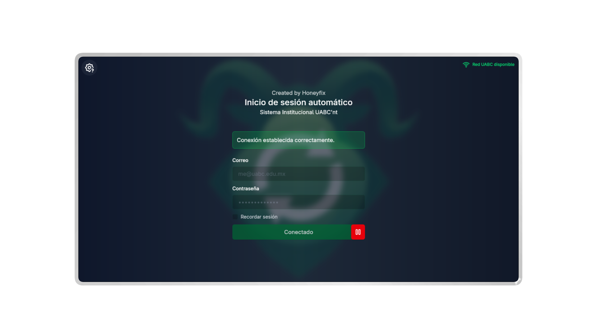

 
<div align="center">

# Cima Sync - Cimarrones 24/7
<br>



<br>
<br>

**Autenticación automática para la red WiFi de la Universidad Autónoma de Baja California**

<br>

[](README_EN.md)

[](https://rust-lang.org)
[](https://reactjs.org)
[](https://tauri.app)
[](https://www.typescriptlang.org)
[](https://www.gnu.org/licenses/gpl-3.0)

[](https://github.com/Yoyiyoniu/Cima-Sync)
[](https://github.com/Yoyiyoniu/Cima-Sync)

### 🎬 Simple Demo

[](https://www.youtube.com/watch?v=4Ypd7N2Z7c4)

</div>

---

## 🎉 ¡Gran Noticia! - Implementación Oficial

> **¡Gracias al interés de la comunidad UABC nos contactó para implementar esta aplicación de forma oficial en la aplicación de UABC Estudiantes!** 
> 
> *(No te preocupes aquí la calidad sobra querido estudiante)*
> 
> En cuanto esté implementada lo publicaré en redes sociales. ¡Muchas gracias por el apoyo cimarrones! <3

---

## Descripción

**Cima Sync** es una aplicación de escritorio multiplataforma que automatiza el proceso de autenticación en el portal cautivo de la red WiFi de la Universidad Autónoma de Baja California (UABC). La aplicación detecta automáticamente cuando el usuario se conecta a la red UABC y realiza el login de forma transparente, eliminando la necesidad de ingresar manualmente las credenciales cada vez.

### Características principales

| Característica | Descripción |
|----------------|-------------|
| Autenticación automática | Login automático al conectarse a la red UABC |
| Almacenamiento seguro | Uso de Keyring/Llavero del sistema operativo (encriptación nativa) |
| Monitoreo continuo | Verificación periódica de la conexión |
| Multiplataforma | Funciona en Windows, macOS y Linux |
| Inicio automático | Opción para iniciar automáticamente al encender la PC |


---

## Arquitectura del proyecto

### Stack

#### **Frontend**
- **React 18**
- **TypeScript**
- **Tailwind CSS**

#### **Backend**
- **Rust** - Lógica de autenticación y networking
- **Tauri 2** - Framework para aplicaciones de escritorio multiplataforma
- **reqwest** - Cliente HTTP para Rust
- **Keyring** - Gestión segura de credenciales nativa
- **SQLite** - Configuración de la aplicación

### Estructura del proyecto

```
Cima-Sync/
├── 📁 src/                    # Frontend React + TypeScript
│   ├── 📁 components/         # Componentes reutilizables
│   ├── 📁 controller/         # Controladores de base de datos
│   ├── 📁 hooks/              # Hooks personalizados
│   └── 📁 assets/             # Imágenes e iconos
├── 📁 src-tauri/              # Backend Rust + Tauri
│   ├── 📁 src/                # Código fuente en Rust
│   └── Cargo.toml             # Dependencias de Rust
└── package.json               # Dependencias de Node.js
```

---

## Instalación y uso

### Requisitos previos

- **Rust** (versión 1.70+)
- **Node.js** (versión 18+) o **Bun**
- **Cargo** (incluido con Rust)

### Instalación

#### 1. **Clonar el repositorio**
```bash
git clone https://github.com/Yoyiyoniu/Cima-Sync.git
cd Cima-Sync
```

#### 2. **Instalar dependencias**
```bash
# Instalar dependencias de Node.js
npm install
# o con Bun
bun install
```

#### 3. **Compilar y ejecutar**
```bash
# Modo desarrollo escritorio
npm run tauri dev

# Construir para producción
npm run tauri build
```

---

## Seguridad

### Almacenamiento de credenciales
- Las credenciales se almacenan de forma segura utilizando el llavero nativo del sistema operativo (Windows Credential Manager, macOS Keychain, Linux Secret Service).

### Certificados SSL
- La aplicación maneja certificados SSL autofirmados del portal UABC
- Se utilizan configuraciones seguras para las peticiones HTTP

---

## Desarrollo

### Scripts disponibles

| Comando | Descripción |
|---------|-------------|
| `npm run tauri dev` | Aplicación Tauri en modo desarrollo |
| `npm run tauri build` | Build de la app de escritorio |

### Estructura de desarrollo

- **Frontend**: `src/` - React + TypeScript + Tailwind CSS
- **Backend**: `src-tauri/src/` - Rust + Tauri
- **Configuración**: `src-tauri/tauri.conf.json` - Configuración de Tauri

---

## Contribución

Las contribuciones son bienvenidas. Para contribuir:

1. Haz un fork del proyecto
2. Crea una rama para tu feature (`git checkout -b feature/AmazingFeature`)
3. Commit de tus cambios (`git commit -m 'Add some AmazingFeature'`)
4. Push a la rama (`git push origin feature/AmazingFeature`)
5. Abre un Pull Request

---

## Licencia

Este proyecto está bajo la **GNU General Public License v3 (GPLv3)**. Esta licencia se elige explícitamente para proteger el proyecto de cualquier intento de apropiación por parte de la UABC u otras entidades, asegurando que el código y sus derivados permanezcan libres bajo los términos de la GPLv3 y evitando problemas legales en el futuro.

**© 2025 Rodrigo Gibran Felix Leon**

### Términos de la GPLv3

| Permiso | Descripción |
|---------|-------------|
| Uso libre | Puedes usar, estudiar y compartir el software |
| Modificaciones | Puedes modificar el código fuente |
| Copyleft | Cualquier trabajo derivado debe usar la misma licencia GPLv3 |
| Código abierto | Si distribuyes versiones modificadas, debes compartir el código fuente |

### Ver licencia completa

Para ver los términos completos de la licencia, consulta el archivo [`LICENSE`](LICENSE) en este repositorio.

---

## Descargo de responsabilidad

> El autor estaba cansado porque siempre se le desconectaba así que creó esta aplicación.

---

## Autor

<div align="center">

**Rodrigo Gibran Felix Leon**

Estudiante de la Universidad Autónoma de Baja California

[](https://github.com/Yoyiyoniu)

</div>

---

<div align="center">

**¡No olvides darle una estrella al proyecto si te fue útil!**

</div>

