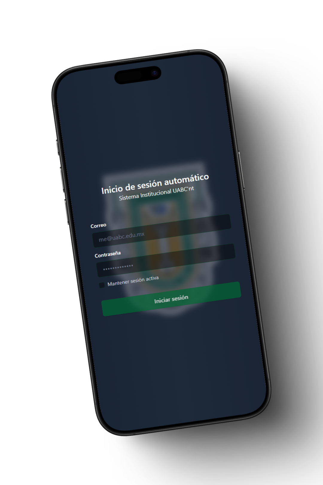

<div align="center">

# Cima Sync - Cimarrones 24/7



**Automatic authentication for the WiFi network of the Autonomous University of Baja California**

[](https://rust-lang.org)
[](https://reactjs.org)
[](https://tauri.app)
[](https://www.typescriptlang.org)
[](https://www.gnu.org/licenses/gpl-3.0)

[](https://github.com/Yoyiyoniu/Cima-Sync)
[](https://github.com/Yoyiyoniu/Cima-Sync)

</div>

---

## 📋 Description

**Cima Sync** is a cross-platform desktop application that automates the authentication process for the captive portal of the WiFi network at the Autonomous University of Baja California (UABC). The application automatically detects when the user connects to the UABC network and performs login transparently, eliminating the need to manually enter credentials each time.

### ✨ Main Features

| Feature | Description |
|---------|-------------|
| 🔄 **Automatic Authentication** | Automatic login when connecting to UABC network |
| 🔒 **Secure Storage** | Local credential storage with encryption |
| ⚡ **Continuous Monitoring** | Periodic connection verification |
| 🛡️ **Cross-Platform** | Works on Windows, macOS and Linux |
| 🚀 **Auto-Start** | Option to start automatically when PC boots |

---

## 🏗️ Project Architecture

### 🛠️ Stack

#### **Frontend**
- **React 18**
- **TypeScript**
- **Tailwind CSS**

#### **Backend**
- **Rust** - Authentication logic and networking
- **Tauri 2** - Framework for cross-platform desktop applications
- **reqwest** - HTTP client for Rust
- **SQLite** - Store data locally and encrypted

### 📁 Project Structure

```
Cima-Sync/
├── 📁 src/                    # Frontend React + TypeScript
│   ├── 📁 components/         # Reusable components
│   ├── 📁 controller/         # Database controllers
│   ├── 📁 hooks/             # Custom hooks
│   └── 📁 assets/            # Images and icons
├── 📁 src-tauri/             # Backend Rust + Tauri
│   ├── 📁 src/
│   │   ├── 🔧 auth.rs        # Authentication logic
│   │   ├── 🔧 lib.rs         # Process execution logic
│   │   └── 🔧 tray.rs        # Tray icon management
│   └── 📄 Cargo.toml         # Rust dependencies
└── 📄 package.json           # Node.js dependencies
```

---

## 🚀 Installation and Usage

### 📋 Prerequisites

- **Rust** (version 1.70+)
- **Node.js** (version 18+) or **Bun**
- **Cargo** (included with Rust)

### ⚙️ Installation

#### 1. **Clone the repository**
```bash
git clone https://github.com/Yoyiyoniu/Cima-Sync.git
cd Cima-Sync
```

#### 2. **Install dependencies**
```bash
# Install Node.js dependencies
npm install
# or with Bun
bun install
```

#### 3. **Compile and run**
```bash
# Desktop development mode
npm run tauri dev

# Build for production
npm run tauri build
```

---

## 🔒 Security

### 🔐 Credential Storage
- Credentials are stored locally in a SQLite database
- Data is encrypted before being saved

### 🛡️ SSL Certificates
- The application handles self-signed SSL certificates from the UABC portal
- Secure configurations are used for HTTP requests

---

## 🛠️ Development

### 📜 Available Scripts

| Command | Description |
|---------|-------------|
| `npm run dev` | Vite development server |
| `npm run tauri dev` | Tauri application in development mode |
| `npm run build` | Frontend build |
| `npm run tauri android` | Tauri application in android development mode |
| `npm run tauri build` | Complete application build |
| `npm run preview` | Build preview |

### 🏗️ Development Structure

- **Frontend**: `src/` - React + TypeScript + Tailwind CSS
- **Backend**: `src-tauri/src/` - Rust + Tauri
- **Configuration**: `src-tauri/tauri.conf.json` - Tauri configuration

---

## 🤝 Contributing

Contributions are welcome. To contribute:

1. 🍴 Fork the project
2. 🌿 Create a feature branch (`git checkout -b feature/AmazingFeature`)
3. 💾 Commit your changes (`git commit -m 'Add some AmazingFeature'`)
4. 📤 Push to the branch (`git push origin feature/AmazingFeature`)
5. 🔄 Open a Pull Request

---

## 📄 License

This project is under the **GNU General Public License v3 (GPLv3)**.

**© 2025 Rodrigo Gibran Felix Leon**

### 📋 GPLv3 Terms:

| Permission | Description |
|------------|-------------|
| ✅ **Free Use** | You can use, study and share the software |
| ✅ **Modifications** | You can modify the source code |
| ⚠️ **Copyleft** | Any derivative work must use the same GPLv3 license |
| ⚠️ **Open Source** | If you distribute modified versions, you must share the source code |

### 📄 View Complete License

To see the complete license terms, check the [`LICENSE`](LICENSE) file in this repository.

---

## ⚠️ Disclaimer

> The author was tired because he kept getting disconnected so he created this application.

---

## 👨‍💻 Author

<div align="center">

**Rodrigo Gibran Felix Leon**

🎓 Student at the Autonomous University of Baja California

[](https://github.com/Yoyiyoniu)

</div>

---

<div align="center">

**⭐ Don't forget to give the project a star if it was useful to you! ⭐**

</div> 