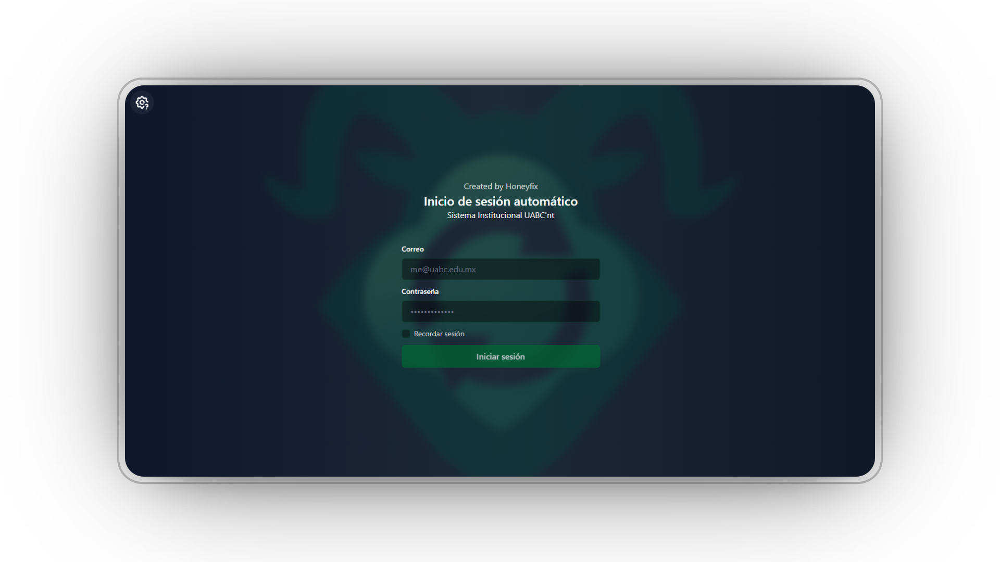

<div align="center">

# Cima Sync - Cimarrones 24/7
<br>



<br>
<br>

**Automatic authentication for the WiFi network of the Autonomous University of Baja California**

<br>

[](README.md)

[](https://rust-lang.org)
[](https://reactjs.org)
[](https://tauri.app)
[](https://www.typescriptlang.org)
[](https://www.gnu.org/licenses/gpl-3.0)

[](https://github.com/Yoyiyoniu/Cima-Sync)
[](https://github.com/Yoyiyoniu/Cima-Sync)

### 🎬 Simple Demo

[](https://www.youtube.com/watch?v=4Ypd7N2Z7c4)

</div>

---

## 🎉 Great News! - Official Implementation

> **Thanks to the UABC community's interest, they contacted us to implement this application officially in the UABC Estudiantes app!** 
> 
> *(Don't worry, quality is abundant here dear student)*
> 
> As soon as it's implemented, I'll announce it on social media. Thank you so much for the support cimarrones! <3

---

## Overview

**Cima Sync** is a cross-platform desktop application that automates the authentication process on the WiFi captive portal of the Autonomous University of Baja California (UABC). The app automatically detects when the user connects to the UABC network and logs in transparently, removing the need to manually enter credentials each time.

### Key Features

| Feature | Description |
|----------------|-------------|
| Automatic authentication | Auto login when connecting to the UABC network |
| Secure storage | Uses OS native Keyring/Keychain (native encryption) |
| Continuous monitoring | Periodic connection checks |
| Cross-platform | Works on Windows, macOS, and Linux |
| Auto start | Option to launch automatically on system startup |


---

## Project Architecture

### Stack

#### **Frontend**
- **React 18**
- **TypeScript**
- **Tailwind CSS**

#### **Backend**
- **Rust** - Authentication and networking logic
- **Tauri 2** - Framework for cross-platform desktop apps
- **reqwest** - HTTP client for Rust
- **Keyring** - Native secure credential management
- **SQLite** - Application configuration

### Project Structure

```
Cima-Sync/
├── 📁 src/                    # Frontend React + TypeScript
│   ├── 📁 components/         # Reusable components
│   ├── 📁 controller/         # Database controllers
│   ├── 📁 hooks/              # Custom hooks
│   └── 📁 assets/             # Images and icons
├── 📁 src-tauri/              # Backend Rust + Tauri
│   ├── 📁 src/                # Rust source code
│   └── Cargo.toml             # Rust dependencies
└── package.json               # Node.js dependencies
```

---

## Installation and Usage

### Prerequisites

- **Rust** (version 1.70+)
- **Node.js** (version 18+) or **Bun**
- **Cargo** (included with Rust)

### Installation

#### 1. **Clone the repository**
```bash
git clone https://github.com/Yoyiyoniu/Cima-Sync.git
cd Cima-Sync
```

#### 2. **Install dependencies**
```bash
# Install Node.js dependencies
npm install
# or with Bun
bun install
```

#### 3. **Build and run**
```bash
# Desktop development mode
npm run tauri dev

# Build for production
npm run tauri build
```

---

## Security

### Credential storage
- Credentials are securely stored using the operating system's native keyring (Windows Credential Manager, macOS Keychain, Linux Secret Service).

### SSL certificates
- The application handles self-signed SSL certificates from the UABC captive portal
- Secure configurations are used for HTTP requests

---

## Development

### Available scripts

| Command | Description |
|---------|-------------|
| `npm run tauri dev` | Tauri app in development mode |
| `npm run tauri build` | Desktop app production build |

### Development layout

- **Frontend**: `src/` - React + TypeScript + Tailwind CSS
- **Backend**: `src-tauri/src/` - Rust + Tauri
- **Configuration**: `src-tauri/tauri.conf.json` - Tauri configuration

---

## Contributing

Contributions are welcome. To contribute:

1. Fork the project
2. Create a feature branch (`git checkout -b feature/AmazingFeature`)
3. Commit your changes (`git commit -m 'Add some AmazingFeature'`)
4. Push to the branch (`git push origin feature/AmazingFeature`)
5. Open a Pull Request

---

## License

This project is licensed under the **GNU General Public License v3 (GPLv3)**. This license is explicitly chosen to protect the project from any attempt at appropriation by UABC or other entities, ensuring that the code and its derivatives remain free under the terms of the GPLv3 and helping prevent legal issues in the future.

**© 2025 Rodrigo Gibran Felix Leon**

### GPLv3 terms

| Permission | Description |
|---------|-------------|
| Free use | You can use, study, and share the software |
| Modifications | You can modify the source code |
| Copyleft | Any derivative work must use the same GPLv3 license |
| Open source | If you distribute modified versions, you must share the source code |

### View full license

To view the full license terms, see the [`LICENSE`](LICENSE) file in this repository.

---

## Disclaimer

> The author was tired of constantly getting disconnected, so they built this app.

---

## Author

<div align="center">

**Rodrigo Gibran Felix Leon**

Student at the Autonomous University of Baja California

[](https://github.com/Yoyiyoniu)

</div>

---

<div align="center">

**If this project helped you, please consider giving it a star!**

</div>

